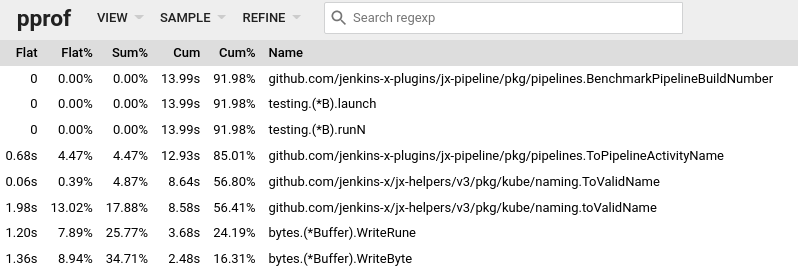

One issue with JenkinsX (JX) v3 is that the build number for pipelines is not monotonically increasing, but rather random.
What that means is, if we open a pull request (PR) for a repository, then the first JX pipeline for that pull request will have build number set to 1.
With time, you are commiting changes to that pull request and pushing it to the remote repository in the version control system of your choice triggering more builds with different build numbers.
Let's assume you now have 10 builds for that PR, if for some reason, the first build gets removed (either we delete the pipeline activity from JenkinsX or it gets garbage collected), then the 11th build will have a build number of 1 again.
This is a bug, as the build number should have been 11 instead of 1 (Build numbers should monotonically increase!)

Let's analyze what the code is doing:

```bash
b := 1
for {
    build = strconv.Itoa(b)
    name := naming.ToValidName(prefix + build)
    found := false
    for i := range paList {
        pa := &paList[i]
        if pa.Name == name {
            found = true
            break
        }
    }
    if !found {
        pr.Labels["build"] = build
        return name
    }
    b++
}
```

In order to illustrate the issue, we create a test contruct (Oh no, the TDD police!) where we have pipeline activites with build number 1 and 5.

- We start with build number set to 1, find 1, break out of the loop and increment build number to 2
- We create a pipeline activity name with build number set to 2
- We loop again but with build number set to 2 and cannot find any pipeline activity with build number set to 2.
- We return the pipeline activity name with build number set to 2.

We can tweak the logic to keep track of higher build numbers.

```bash
b := 1
for {
    build = strconv.Itoa(b)
    name := naming.ToValidName(prefix + build)
    found := false
    for i := range paList {
        pa := &paList[i]
        if strings.Contains(pa.Name, prefix) {
            buildNum, _ := strconv.Atoi(strings.Split(pa.Name, prefix)[1])
            if buildNum > b {
                b = buildNum
                build = strconv.Itoa(b)
                name = naming.ToValidName(prefix + build)
            }
        }
        if pa.Name == name {
            found = true
            break
        }
    }
    if !found {
        build = strconv.Itoa(b)
        pr.Labels["build"] = build
        name = naming.ToValidName(prefix + build)
        return name
    }
    b++
}
```

Everything is pretty much the same except the looping part:

- We start with build number set to 1, find 1, break out of the loop and increment build number to 2
- We create a pipeline activity name with build number set to 2
- We loop again but with build number set to 2 and cannot find any pipeline activity with build number set to 2.
- **But we find a pipeline activity with build number 5, which is greater than 2, and set the build number to 5, and create a pipeline activity with build number set to 5.**
- We start with build number set to 5, find the pipeline activity with build number 5, break out of the loop, and increment build number to 6 and create a pipeline activity with build number set to 6.
- We loop again but with build number set to 6 and cannot find any pipeline activity with build number set to 2.
- We return the pipeline activity name with build number set to 6.

So, this works and we write a few more test cases to validate that is works for other conditions.
Are we there yet?

Well, let's try to run a benchmark on this new code, and compare it to the old but buggy code.
Afterall, we do not want to slow down JenkinsX!

> Disclaimer:
>
> Run benchmark on a dedicated hardware, or remember to close all resource hungry applications when running benchmark!
> I do not have a dedicated one, so I closed chrome and slack.

Running bench mark on the new code:

```bash
KUBECONFIG=/cluster/connections/not/allowed CGO_ENABLED=0 GO111MODULE=on go test -v -p 4 --tags=unit -failfast -short -run=- -bench=. -count=10 -vet=off
goos: linux
goarch: amd64
pkg: github.com/jenkins-x-plugins/jx-pipeline/pkg/pipelines
BenchmarkPipelineBuildNumber
BenchmarkPipelineBuildNumber-12    	  535250	      2046 ns/op
BenchmarkPipelineBuildNumber-12    	  570451	      2034 ns/op
BenchmarkPipelineBuildNumber-12    	  626732	      1994 ns/op
BenchmarkPipelineBuildNumber-12    	  511844	      2028 ns/op
BenchmarkPipelineBuildNumber-12    	  542272	      2039 ns/op
BenchmarkPipelineBuildNumber-12    	  599572	      2051 ns/op
BenchmarkPipelineBuildNumber-12    	  633604	      2026 ns/op
BenchmarkPipelineBuildNumber-12    	  595767	      2003 ns/op
BenchmarkPipelineBuildNumber-12    	  742741	      2043 ns/op
BenchmarkPipelineBuildNumber-12    	  570111	      2002 ns/op
```

Running bench mark on the old code:

```bash
KUBECONFIG=/cluster/connections/not/allowed CGO_ENABLED=0 GO111MODULE=on go test -v -p 4 --tags=unit -failfast -short -run=- -bench=. -count=10 -vet=off
goos: linux
goarch: amd64
pkg: github.com/jenkins-x-plugins/jx-pipeline/pkg/pipelines
BenchmarkPipelineBuildNumber
BenchmarkPipelineBuildNumber-12    	  923767	      1174 ns/op
BenchmarkPipelineBuildNumber-12    	  942489	      1218 ns/op
BenchmarkPipelineBuildNumber-12    	 1000000	      1202 ns/op
BenchmarkPipelineBuildNumber-12    	 1000000	      1193 ns/op
BenchmarkPipelineBuildNumber-12    	 1000000	      1172 ns/op
BenchmarkPipelineBuildNumber-12    	  970870	      1182 ns/op
BenchmarkPipelineBuildNumber-12    	  949488	      1207 ns/op
BenchmarkPipelineBuildNumber-12    	 1000000	      1182 ns/op
BenchmarkPipelineBuildNumber-12    	  945907	      1188 ns/op
BenchmarkPipelineBuildNumber-12    	  963471	      1197 ns/op
```

We have made the code almost twice as slow!

But why is that?
We have not introduced any additional loops.

Luckily, golang has tools to figure out these kind of issues.
We run the same benchmarking code but we also save the cpu profile to a file `cpu.out`.

```bash
KUBECONFIG=/cluster/connections/not/allowed CGO_ENABLED=0 GO111MODULE=on go test -v -p 4 --tags=unit -failfast -short -run=- -bench=. -count=1 -vet=off -benchtime=10s -cpuprofile=cpu.out
goos: linux
goarch: amd64
pkg: github.com/jenkins-x-plugins/jx-pipeline/pkg/pipelines
BenchmarkPipelineBuildNumber
BenchmarkPipelineBuildNumber-12    	 5908232	      1994 ns/op
PASS
ok  	github.com/jenkins-x-plugins/jx-pipeline/pkg/pipelines	13.984s
```

Once the benchmark code has completed, we can use pprof to display the results in a web broswer at port 8080.

```bash
go tool pprof -http=:8080 cpu.out
```

In the browser, we can navigate to the view -> top.
This will show us the top functions which consume the most resources.



Interestingly, we see that `naming.ToValidName` is taking quite a bit of resources.
it is also being called multiple times!

Clicking on view -> source, will take us to the source file, which shows us how us cumulative and flat times.

```bash
github.com/jenkins-x-plugins/jx-pipeline/pkg/pipelines.ToPipelineActivityName
/home/ankitm123/work/jx-pipeline/pkg/pipelines/pipelines.go

  Total:       780ms     13.33s (flat, cum) 85.28%
     18            .          .           	labels := pr.Labels
     19            .          .           	if labels == nil {
     20            .          .           		return ""
     21            .          .           	}
     22            .          .
     23         50ms       90ms           	build := labels["build"]
     24            .      240ms           	owner := activities.GetLabel(labels, activities.OwnerLabels)
     25         20ms      110ms           	repository := activities.GetLabel(labels, activities.RepoLabels)
     26         30ms      270ms           	branch := activities.GetLabel(labels, activities.BranchLabels)
     27            .          .
     28            .          .           	if owner == "" || repository == "" || branch == "" {
     29            .          .           		return ""
     30            .          .           	}
     31            .          .
     32         40ms      770ms           	prefix := owner + "-" + repository + "-" + branch + "-"
     33            .          .           	if build == "" {
     34         20ms       50ms           		buildID := labels["lighthouse.jenkins-x.io/buildNum"]
     35            .          .           		if buildID == "" {
     36            .          .           			return ""
     37            .          .           		}
     38         20ms       20ms           		for i := range paList {
     39         10ms       10ms           			pa := &paList[i]
     40         80ms       80ms           			if pa.Labels == nil {
     41            .          .           				continue
     42            .          .           			}
     43        250ms      730ms           			if pa.Labels["buildID"] == buildID || pa.Labels["lighthouse.jenkins-x.io/buildNum"] == buildID {
     44         10ms       10ms           				if pa.Spec.Build != "" {
     45            .          .           					pr.Labels["build"] = pa.Spec.Build
     46            .          .           					return pa.Name
     47            .          .           				}
     48            .          .           			}
     49            .          .           		}
     50            .          .
     51            .          .           		// no PA has the buildNum yet so lets try find the next PA build number...
     52            .          .           		b := 1
     53            .          .           		for {
     54         10ms       30ms           			build = strconv.Itoa(b)
     55         30ms      5.02s           			name := naming.ToValidName(prefix + build)
     56            .          .           			found := false
     57         20ms       20ms           			for i := range paList {
     58         10ms       10ms           				pa := &paList[i]
     59         60ms      490ms           				if strings.Contains(pa.Name, prefix) {
     60            .          .           					buildNum, _ := strconv.Atoi(strings.Split(pa.Name, prefix)[1])
     61            .          .           					if buildNum > b {
     62            .          .           						b = buildNum
     63            .          .           						build = strconv.Itoa(b)
     64            .          .           						name = naming.ToValidName(prefix + build)
     65            .          .           					}
     66            .          .           				}
     67         20ms       20ms           				if pa.Name == name {
     68            .          .           					found = true
     69            .          .           					break
     70            .          .           				}
     71            .          .           			}
     72            .          .           			if !found {
     73         50ms       70ms           				build = strconv.Itoa(b)
     74         30ms      210ms           				pr.Labels["build"] = build
     75         20ms      5.08s           				name = naming.ToValidName(prefix + build)
     76            .          .           				return name
     77            .          .           			}
     78            .          .           			b++
     79            .          .           		}
     80            .          .           	}
```

It's clear that the code takes a significant amount of time running `naming.ToValidName`.
The sad thing is that, in our fix, we are calling this function more number of times than the old code.
The cumulative time has increased by 2 seconds (roughly 11.5 seconds to 13.5 seconds!)

Now, there are 2 ways to fix it:

- Make less calls to `naming.ToValidName`
- Optimize `naming.ToValidName`

Although `naming.ToValidName` is part of the bigger JX codebase, it's not part of jx-pipeline codebase, so we can first try to tweak our logic to not invoke `naming.ToValidName` multiple times, before we focus our attention on optimizing `naming.ToValidName`.
This is also a better approach for learning as in some cases,

- A function that we invoke may be in some other external library which we may have limited access to
- May not even understand what it does (complicated logic or different language)
- Already optimized, this is just some resource intensive code.

So, we make a simple change to only loop once, instead of looping many times like before, and call `naming.ToValidName` once

```bash
b := 1
found := false
var name string
for i := range paList {
    pa := &paList[i]
    if strings.Contains(pa.Name, prefix) {
        buildNum, _ := strconv.Atoi(strings.Split(pa.Name, prefix)[1])
        if buildNum > b {
            b = buildNum
            found = true
        }
    }
}
if found {
    b++
}
build = strconv.Itoa(b)
pr.Labels["build"] = build
name = naming.ToValidName(prefix + build)
return name
```

Now if we take a look at thwe new code, we can see that the cumulative time for the function has gone down to match the old code.

```bash
github.com/jenkins-x-plugins/jx-pipeline/pkg/pipelines.ToPipelineActivityName
/home/ankitm123/work/jx-pipeline/pkg/pipelines/pipelines.go

  Total:       910ms     11.72s (flat, cum) 82.42%
     18            .          .           	labels := pr.Labels
     19            .          .           	if labels == nil {
     20            .          .           		return ""
     21            .          .           	}
     22            .          .
     23         10ms       70ms           	build := labels["build"]
     24         40ms      290ms           	owner := activities.GetLabel(labels, activities.OwnerLabels)
     25         30ms      320ms           	repository := activities.GetLabel(labels, activities.RepoLabels)
     26         40ms      280ms           	branch := activities.GetLabel(labels, activities.BranchLabels)
     27            .          .
     28            .          .           	if owner == "" || repository == "" || branch == "" {
     29            .          .           		return ""
     30            .          .           	}
     31            .          .
     32         30ms      1.16s           	prefix := owner + "-" + repository + "-" + branch + "-"
     33            .          .           	if build == "" {
     34         50ms      120ms           		buildID := labels["lighthouse.jenkins-x.io/buildNum"]
     35            .          .           		if buildID == "" {
     36            .          .           			return ""
     37            .          .           		}
     38         10ms       10ms           		for i := range paList {
     39            .          .           			pa := &paList[i]
     40         40ms       40ms           			if pa.Labels == nil {
     41            .          .           				continue
     42            .          .           			}
     43        380ms      1.09s           			if pa.Labels["buildID"] == buildID || pa.Labels["lighthouse.jenkins-x.io/buildNum"] == buildID {
     44         20ms       20ms           				if pa.Spec.Build != "" {
     45            .          .           					pr.Labels["build"] = pa.Spec.Build
     46            .          .           					return pa.Name
     47            .          .           				}
     48            .          .           			}
     49            .          .           		}
     50            .          .
     51            .          .           		// no PA has the buildNum yet so lets try find the next PA build number...
     52            .          .           		b := 1
     53            .          .           		found := false
     54            .          .           		var name string
     55         30ms       30ms           		for i := range paList {
     56         10ms       10ms           			pa := &paList[i]
     57        130ms      790ms           			if strings.Contains(pa.Name, prefix) {
     58            .          .           				buildNum, _ := strconv.Atoi(strings.Split(pa.Name, prefix)[1])
     59            .          .           				if buildNum > b {
     60            .          .           					b = buildNum
     61            .          .           					found = true
     62            .          .           				}
     63            .          .           			}
     64            .          .           		}
     65         10ms       10ms           		if found {
     66            .          .           			b++
     67            .          .           		}
     68         20ms       70ms           		build = strconv.Itoa(b)
     69         20ms      270ms           		pr.Labels["build"] = build
     70         40ms      7.14s           		name = naming.ToValidName(prefix + build)
     71            .          .           		return name
     72            .          .           	}
     73            .          .           	if build == "" {
     74            .          .           		return ""
     75            .          .           	}
```

We can also run the benchmark test 10 times, like before, and see now the time per operation is back to the 1100-1300 ns range.

```bash
KUBECONFIG=/cluster/connections/not/allowed CGO_ENABLED=0 GO111MODULE=on go test -v -p 4 --tags=unit -failfast -short -run=- -bench=. -count=10 -vet=off
goos: linux
goarch: amd64
pkg: github.com/jenkins-x-plugins/jx-pipeline/pkg/pipelines
BenchmarkPipelineBuildNumber
BenchmarkPipelineBuildNumber-12    	 1000000	      1273 ns/op
BenchmarkPipelineBuildNumber-12    	  974383	      1238 ns/op
BenchmarkPipelineBuildNumber-12    	 1000000	      1271 ns/op
BenchmarkPipelineBuildNumber-12    	  905545	      1214 ns/op
BenchmarkPipelineBuildNumber-12    	  848884	      1230 ns/op
BenchmarkPipelineBuildNumber-12    	  925057	      1229 ns/op
BenchmarkPipelineBuildNumber-12    	 1000000	      1251 ns/op
BenchmarkPipelineBuildNumber-12    	  914018	      1230 ns/op
BenchmarkPipelineBuildNumber-12    	 1000000	      1235 ns/op
BenchmarkPipelineBuildNumber-12    	  938479	      1243 ns/op
PASS
ok  	github.com/jenkins-x-plugins/jx-pipeline/pkg/pipelines	11.968s
```

So, the code is fixed, and it's not that slow either!
May be we can next look at how to optimize `naming.ToValidName` in a subsequent blog post.
